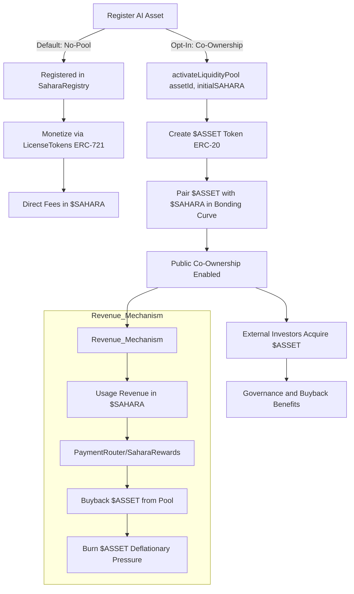

```mermaid
graph TD  
    A[Register AI Asset] -->|Default: No-Pool| B[Registered in SaharaRegistry]  
    B --> C[Monetize via LicenseTokens ERC-721]  
    C --> D[Direct Fees in $SAHARA]  

    A -->|Opt-In: Co-Ownership| E[activateLiquidityPool assetId, initialSAHARA]  
    E --> F[Create $ASSET Token ERC-20]  
    F --> G[Pair $ASSET with $SAHARA in Bonding Curve]  
    G --> H[Public Co-Ownership Enabled]  
    H --> I[External Investors Acquire $ASSET]  
    I --> J[Governance and Buyback Benefits]  

    subgraph Revenue_Mechanism  
        Revenue_Mechanism --> K
        K[Usage Revenue in $SAHARA] --> L[PaymentRouter/SaharaRewards]  
        L --> M[Buyback $ASSET from Pool]  
        M --> N[Burn $ASSET Deflationary Pressure]  
    end  

    H --> Revenue_Mechanism
```
