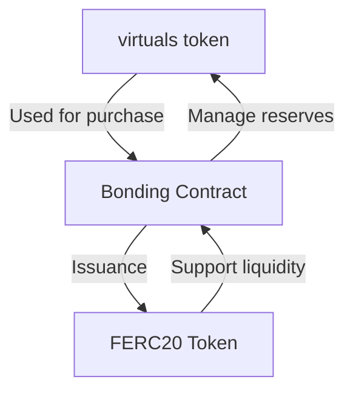
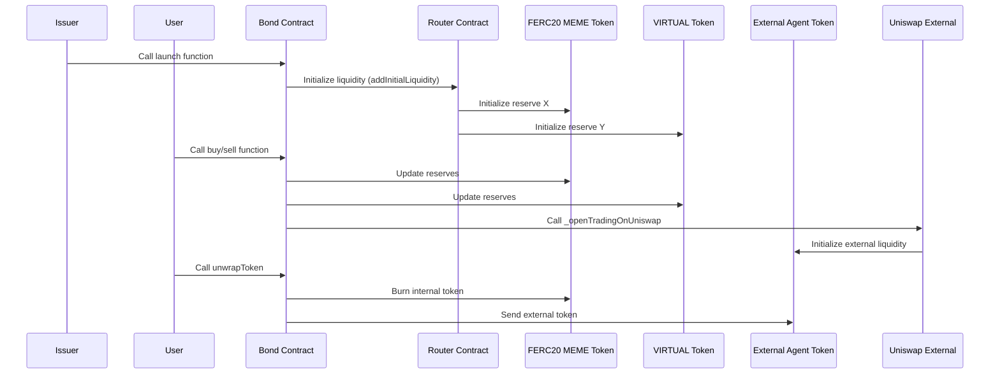
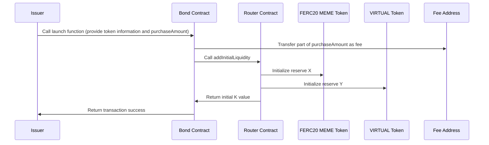
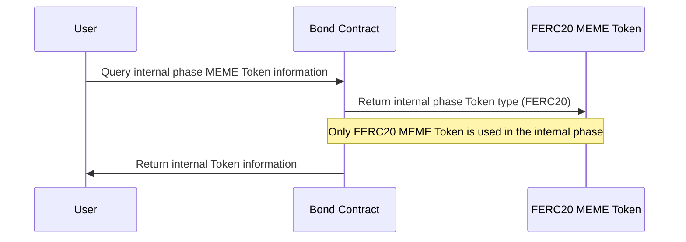
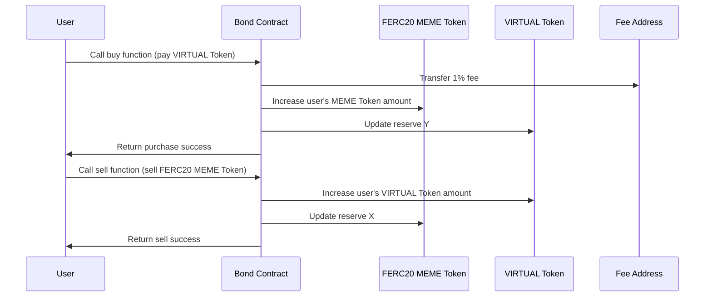
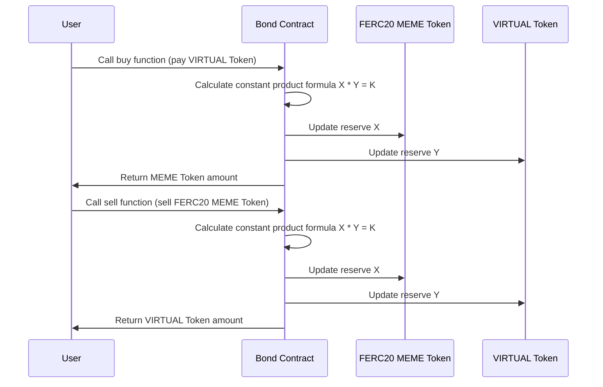
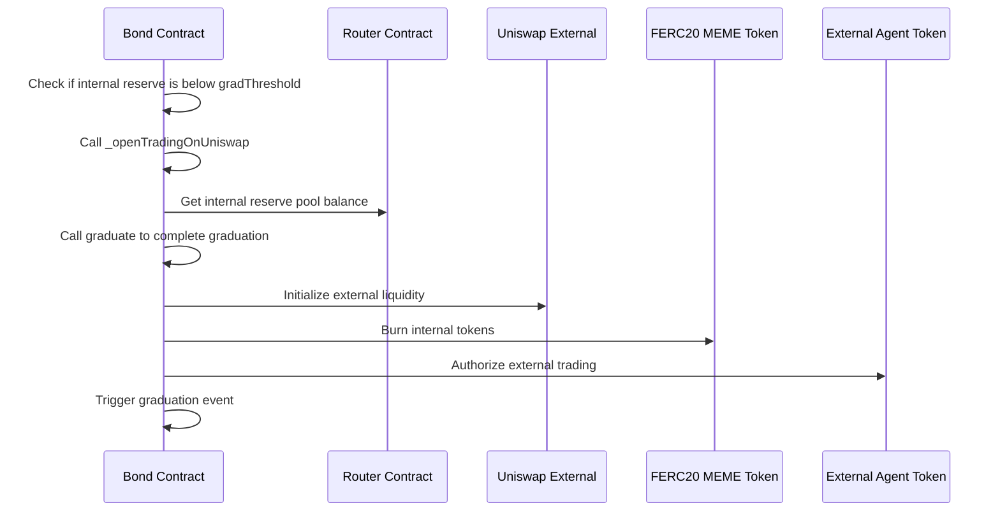
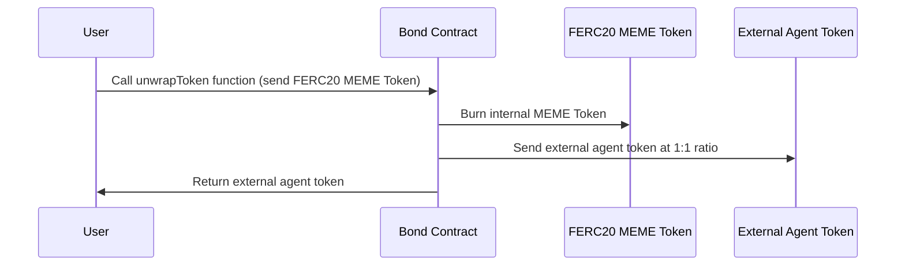

Analysis of the Internal and External Processes of Virtual Protocols

# what is bonding.sol

Issuance and management of FERC20 contracts

# Internal Trading Phase

## Who can issue internal tokens? How to issue them? Is there a fee for issuing them and who receives it?
1. The issuer calls the launch function on the bond.sol contract to issue tokens. From the code and logic of the `launch` function, it can be seen that the caller needs to provide some basic token information and pay a certain amount of VIRTUAL Tokens (`purchaseAmount`), part of which is as a fee (`fee`), and the other part is used to purchase the initial FERC20 MEME Tokens. The `fee` is ultimately transferred to a specific fee receiving address `feeTo`. In the `launch` function, the initial internal liquidity is set through the `router.addInitialLiquidity` method. This method initializes the reserves of MEME Token and VIRTUAL Token (`X` and `Y`) and calculates the initial `K` value. This step provides the foundation for the transaction logic of the Bonding Curve. The FERC20 contract here is the MEME Token used during the internal phase and is only used internally; when it moves to the external phase, it becomes another token.

## Is there a fee for trading during the internal phase? Who receives the fee?
2. During the internal phase, the `bond.sol` contract provides buy and sell functions for internal traders. In the `buy` function, when a user purchases FERC20 MEME Tokens, they have to pay a **1% fee**. The fee is transferred to a specific fee address (`feeTo`), specified by `factory.taxVault()`.

## What determines the price during the internal trading phase? Is this pricing mechanism implemented in a smart contract?
4. During the internal trading phase, the buying and selling transactions are based on the constant product formula of the Bonding Curve `X * Y = K`, where `X` and `Y` represent the reserves of the internal MEME Token and VIRTUAL Token, respectively. `K` is a constant value representing the total liquidity of the reserve pool. Users pay VIRTUAL Tokens, and according to the Bonding Curve formula, they can calculate the amount of MEME Tokens they can get, while updating the reserves.

## When will the internal tokens be released to the external market? Is this logic implemented in a smart contract?
6. Automatic release to the external market. When the internal token reserve falls below `gradThreshold`, and the token is still in the internal trading phase, `_openTradingOnUniswap` is called. The main function of `_openTradingOnUniswap` is to migrate the token from the internal phase to the external phase, which includes the following steps: **Stop internal trading and start external trading**, **Obtain the balance of the internal reserve pool**, **Call `graduate` to complete the graduation**, **Initialize external liquidity and agent token**, **Burn internal tokens and authorize external trading**, **Trigger graduation event**

## How can I exchange the internal tokens I bought for external tokens?
8. Users can call the `unwrapToken` function to exchange internal MEME Tokens for external MEME Tokens at a 1:1 ratio. The logic of the function is as follows: users send their internal MEME Tokens (FERC20) to the contract. The contract sends an equal amount of external MEME Tokens (Agent Tokens) to the user at a 1:1 ratio. The internal MEME Tokens are burned during the exchange process to ensure consistency in total supply.

