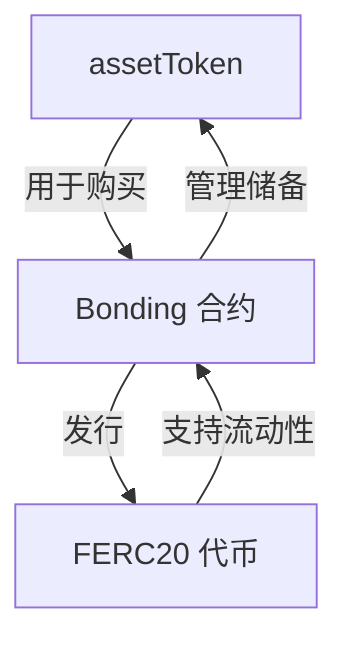
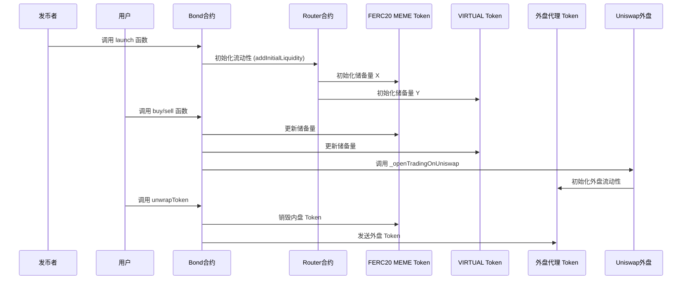
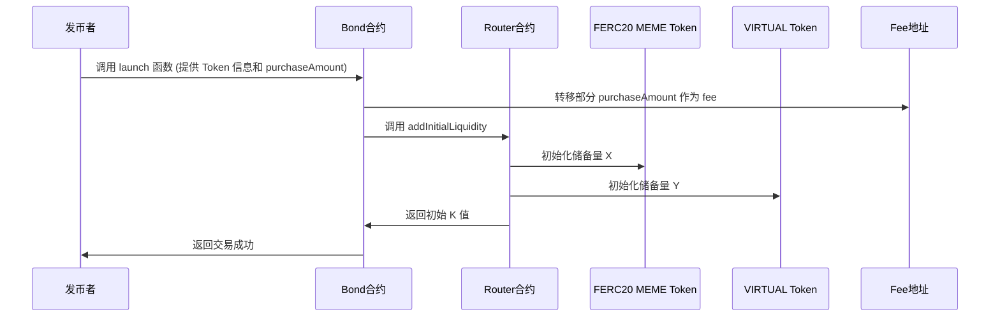
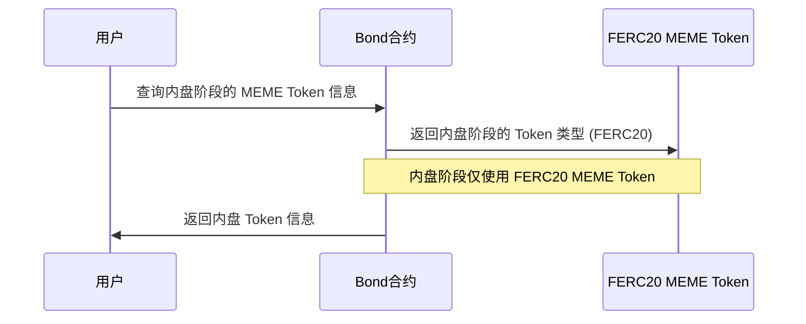
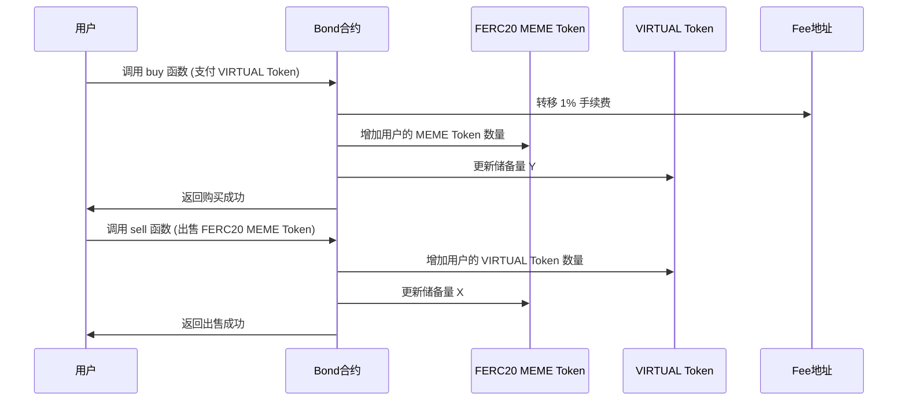
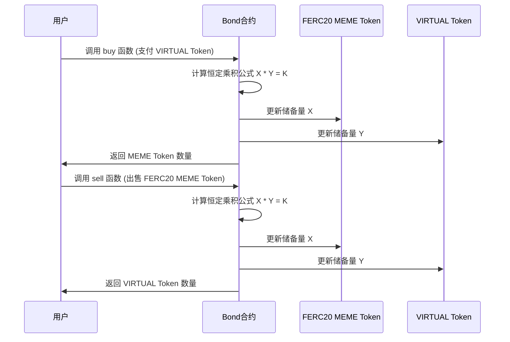
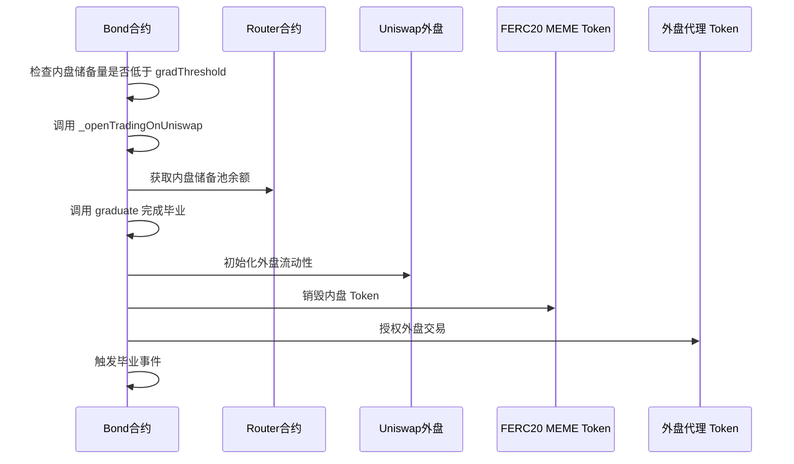
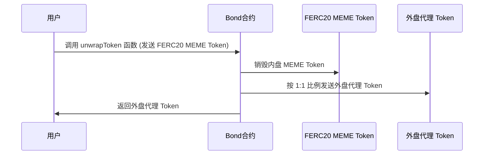

上一篇文章我们讲了virtuals的整体业务流程, 这一篇我们讲讲看一下代码看看之前有没有讲的不多或者比较粗略的地方.

# bonding.sol

发行和管理ERC20合约

# 内盘阶段

## 谁可以发布内盘代币?如何发布?发布需要支付费用吗?费用被谁收走了?
1. 发币者调用bond.sol合约上的launch函数，发币. 从 `launch` 函数的代码和逻辑可以看出，调用方需要提供一些基本的 Token 信息，并支付一定数量的 VIRTUAL Token（`purchaseAmount`），其中一部分作为费用（`fee`），另一部分用于购买初始的 FERC20 MEME Token。`fee` 最终被转移到一个专门的费用接收地址 `feeTo`。在 `launch` 函数中，内盘的初始流动性通过 `router.addInitialLiquidity` 方法设置：
该方法初始化了 MEME Token 和 VIRTUAL Token 的储备量（`X` 和 `Y`），并计算出初始的 `K` 值。这一步为 Bonding Curve 的交易逻辑提供了基础。这里的 FERC20合约 是内盘阶段交易的 MEME Token，仅在内盘阶段使用，当进入到外盘后，会变成另一个 Token。
 

## 内盘买卖阶段,需要支付手续费吗?手续费被谁收走了?
2. 内盘阶段`bond.sol`合约提供buy和sell函数给内盘交易者进行交易. 在 `buy` 函数中，用户购买 FERC20 MEME Token 时需要支付 **1% 的手续费**。手续费会被转移到一个专门的手续费地址（`feeTo`），由 `factory.taxVault()` 指定.

## 内盘交易阶段的价格由什么决定?这个价格机制是在智能合约上实现的吗?
4. 内盘交易阶段, 内盘阶段的买卖交易基于 Bonding Curve 的恒定乘积公式 `X * Y = K`，* `X` 和 `Y` 分别代表内盘 MEME Token 和 VIRTUAL Token 的储备量。* * `K` 是一个恒定值，表示储备池的总流动性。用户支付 VIRTUAL Token，按照 Bonding Curve 的公式计算可以获得的 MEME Token 数量，同时更新储备量。

## 什么时候内盘会发布到外盘?这个逻辑是在智能合约上实现的吗?
6. 自动发布到外盘. 当内盘 Token 的储备量减少到 `gradThreshold` 以下，并且 Token 仍在内盘交易阶段时，`_openTradingOnUniswap` 会被调用。`_openTradingOnUniswap` 的主要功能是将 Token 从内盘阶段迁移到外盘阶段，具体包括以下步骤：** 停止内盘交易并开启外盘交易**, #### **获取内盘储备池的余额**, **调用 `graduate` 完成毕业**, **初始化外盘流动性和代理 Token**,  **销毁内盘 Token 并授权外盘交易**,   **触发毕业事件**

## 我买了内盘代币如何换成外盘代币?
8. 用户可以调用`unwrapToken` 函数, 将内盘的 MEME Token 按照 1:1 的比例兑换成外盘的 MEME Token。整个函数的逻辑是: 用户将持有的内盘 MEME Token（FERC20）发送到合约中。合约按照 1:1 的比例，将等量的外盘 MEME Token（Agent Token）发送给用户。内盘的 MEME Token 在兑换过程中会被销毁，确保总供应量的一致性。

 

